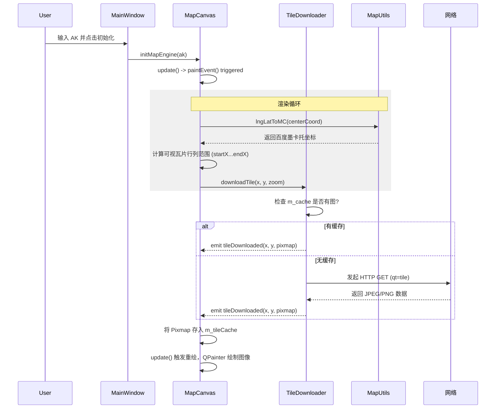

# GeoQt-Client (极地地理信息系统) 技术架构深演文档 (v1.2)

## 1. Qt 项目逻辑架构 (Project Architecture)

项目采用 **MV 模式 (Model-View 混合模式)** 与 **信号槽异步驱动** 架构。

```mermaid
graph TD
    A[main.cpp] --> B[LoginDialog]
    B -- 验证成功 --> C[MainWindow]
    C --> D[MapCanvas (View/Render)]
    D --> E[TileDownloader (Service)]
    E --> F[QNetworkAccessManager]
    D -.-> G[MapUtils (Helper/Math)]
```

- **表示层 (UI/View)**: `MainWindow` 承载主框架，`MapCanvas` 负责底层图形渲染。
- **业务逻辑层 (Logic)**: `LoginDialog` 负责身份鉴权，`MapCanvas::requestVisibleTiles` 负责视口逻辑计算。
- **服务层 (Service)**: `TileDownloader` 封装了网络请求与内存二级缓存。
- **工具层 (Utils)**: `MapUtils` 纯静态数学库，负责 BD09 墨卡托投影算法。

## 2. 核心函数调用关系图

显示地图的一生：从 AK 输入到像素呈现在屏幕。



## 3. 具体实现步骤记录

### 第一阶段：基础设施建设
1. **Logo 资源管理**: 通过 `.qrc` 文件将 `logo.ico` 嵌入二进制，实现窗口与任务栏图标自适应。
2. **安全验证**: 独立 `LoginDialog` 类，重写 `exec()` 循环，确保主窗体加载前完成登录。

### 第二阶段：渲染引擎研发 (核心难点)
1. **反向投影实现**: 百度地图使用 `BD-09` 加密坐标系统。在 `MapUtils` 中实现了基于 `WGS84` 修正的墨卡托算法，确保经纬度与像素点呈一一映射。
2. **瓦片网格计算**: 
   - 定义 1 像素 = $2^{18-z}$ 墨卡托单位。
   - 在 `paintEvent` 中通过 `offset = (TileMC - CenterMC) / scale` 计算每个瓦片相对于屏幕中心的精确像素位置。

### 第三阶段：吞吐量与性能优化
1. **异步并发**: 利用 `QNetworkAccessManager` 的多并发特性，同一时间发起多路瓦片下载，解决界面卡顿。
2. **内存分级缓存**: 
   - 一级：`m_tileCache` (MapCanvas) 记录当前视口快速贴图。
   - 二级：`m_cache` (TileDownloader) 跨区域存储，减少重复网络请求。

### 第四阶段：交互强化
1. **坐标反馈**: 实现了 `mouseMoveEvent` 监听，通过平移增量实时反算经纬度中心点。
2. **平滑缩放**: 滚轮事件触发 `zoomLevel` 增减，并原子化更新瓦片请求队列。

## 4. 后续扩展接口 (Roadmap)
- **Overlays**: 预留 `drawPoint(QPointF)` 接口，将业务坐标转为像素坐标后叠加。
- **SSL 支持**: 若在某些非标准系统下运行，需打包 `libcrypto` 库以支持 HTTPS 瓦片地址。
