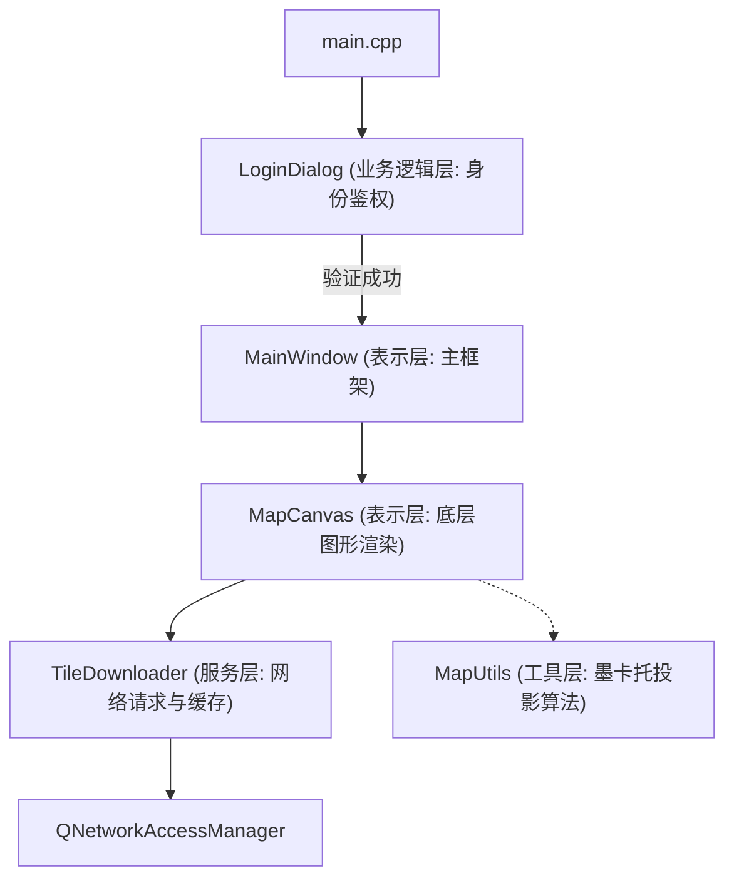
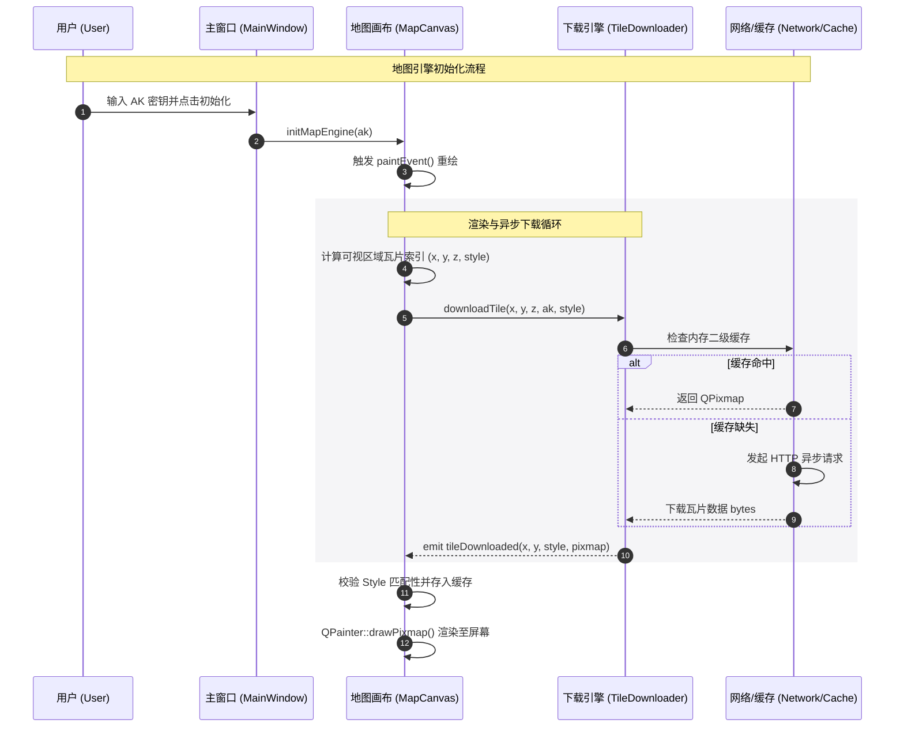
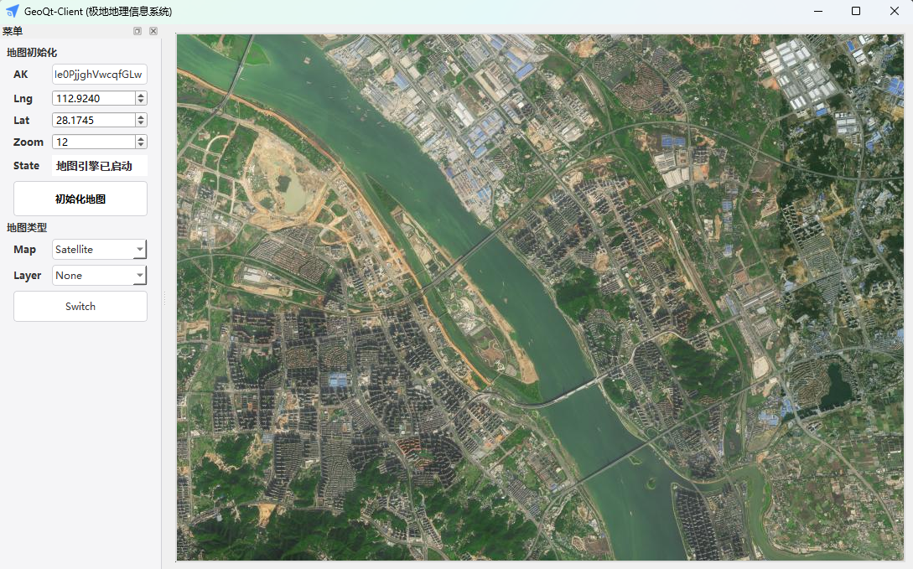
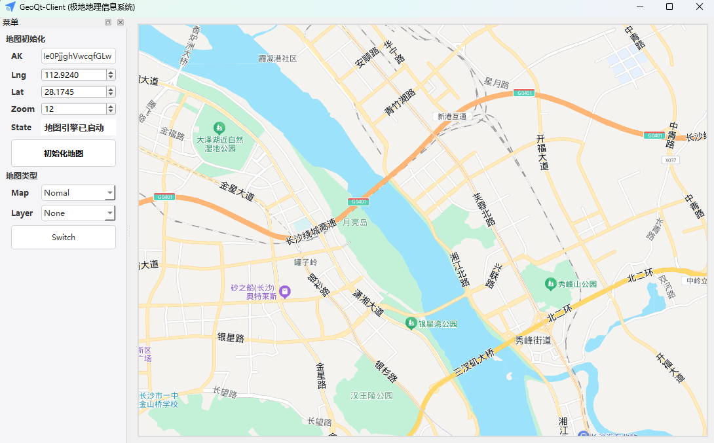

# GeoQt-Client (极地地理信息系统) 技术架构深演文档 (v1.3)

## 1. Qt 项目逻辑架构 (Project Architecture)

项目采用 **MV 模式 (Model-View 混合模式)** 与 **信号槽异步驱动** 架构。

- **表示层 (UI/View)**: `MainWindow` 承载主框架，`MapCanvas` 负责底层原生图形渲染。
- **业务逻辑层 (Logic)**: `LoginDialog` 负责身份鉴权，`MapCanvas::requestVisibleTiles` 负责视口逻辑计算。
- **服务层 (Service)**: `TileDownloader` 封装了网络请求与物理瓦片缓存。
- **工具层 (Utils)**: `MapUtils` 纯静态数学库，负责 BD09 墨卡托投影算法。

## 2. 核心函数调用关系图

显示地图的一生：从 AK 输入到像素呈现在屏幕。

## 3. 运行效果展示

### 3.1 卫星地图模式

### 3.2 普通地图模式

## 4. 具体实现步骤记录

### 第一阶段：基础设施建设
1. **Logo 资源管理**: 通过 `.qrc` 文件将 `logo.ico` 嵌入二进制，实现窗口与任务栏图标自适应。
2. **安全验证**: 独立 `LoginDialog` 类，重写 `exec()` 循环，确保主窗体加载前完成登录。

### 第二阶段：渲染引擎研发 (核心难点)
1. **反向投影实现**: 在 `MapUtils` 中实现了基于 `WGS84` 修正的墨卡托算法，确保经纬度与像素点呈一一映射。
2. **瓦片网格计算**: 在 `paintEvent` 中通过物理位置计算实现像素对齐。
3. **Style 隔离机制**: 在缓存 Key 中引入地图类型前缀（如 `sate_`），解决了异步加载时不同模式瓦片重叠的“重影”问题。

### 第三阶段：吞吐量与性能优化
1. **异步并发**: 利用 `QNetworkAccessManager` 的多并发特性，解决了界面卡顿。
2. **内存分级缓存**: 实现了一级视口缓存与二级跨区域存储，大幅提升二次加载速度。

### 第四阶段：交互强化与视觉美化
1. **坐标持久化**: 系统自动记忆上次关闭时的 `Lng`, `Lat`, `Zoom` 及密钥，实现无缝重启。
2. **UI 视觉体系**:
   - 采用 **Light Theme** 全局配色。
   - 地图区域增加了 **2px #DCDCDC 灰色外边框**，并预填充浅灰色底图，提升了软件开窗时的视觉完整度。
   - 修复了 `QComboBox` 在部分系统下的下拉文字可见性问题。

## 5. 后续扩展接口 (Roadmap)
- **Overlays**: 预留 `drawPoint(QPointF)` 接口。
- **Hardware Acceleration**: 计划引入基于 OpenGL 的硬件纹理加速。
- **SSL 支持**: 内嵌 `libcrypto` 库以适配 HTTPS 瓦片地址。

---
*注：出于安全考虑，提交版本中已删除明文 config.ini 文件。*
